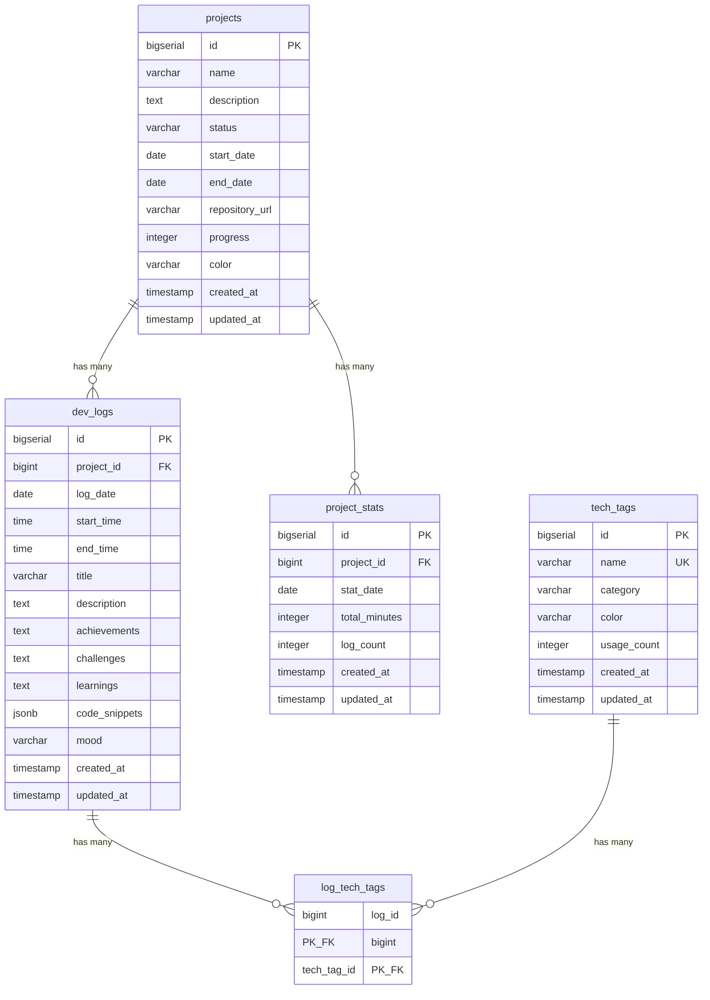

# DevLog Database Schema Documentation

## 📌 목차

- [개요](#개요)
- [ERD 다이어그램](#erd-다이어그램)
- [테이블 설명](#테이블-설명)
  - [projects](#1-projects-테이블)
  - [dev_logs](#2-dev_logs-테이블)
  - [tech_tags](#3-tech_tags-테이블)
  - [log_tech_tags](#4-log_tech_tags-테이블)
  - [project_stats](#5-project_stats-테이블)
- [인덱스](#인덱스)
- [뷰](#뷰)
- [트리거 및 함수](#트리거-및-함수)
- [데이터 타입](#데이터-타입)
- [제약 조건](#제약-조건)

---

## 개요

**데이터베이스**: PostgreSQL 15+
**스키마 버전**: 2.0
**최종 업데이트**: 2025-12-31

DevLog 데이터베이스는 개발자의 일일 개발 활동을 추적하고, 프로젝트를 관리하며, 기술 스택을 태깅하는 시스템입니다.

### 주요 특징

- **프로젝트 중심 설계**: 모든 로그는 프로젝트에 연결됨
- **정규화된 태그 시스템**: 기술 스택 태그는 별도 테이블로 관리
- **자동화된 통계**: 트리거를 통한 usage_count 자동 업데이트
- **시간 추적**: 작업 시작/종료 시간 기록
- **감정 기록**: 5단계 감정 상태 추적

---

## ERD 다이어그램



---

## 테이블 설명

### 1. projects 테이블

프로젝트 정보를 관리하는 마스터 테이블입니다.

**테이블 이름**: `projects`

| 컬럼명 | 데이터 타입 | NULL | 기본값 | 설명 |
|--------|------------|------|--------|------|
| id | BIGSERIAL | NO | AUTO | 프로젝트 고유 ID (Primary Key) |
| name | VARCHAR(255) | NO | - | 프로젝트 이름 |
| description | TEXT | YES | NULL | 프로젝트 설명 |
| status | VARCHAR(50) | NO | 'ACTIVE' | 프로젝트 상태 (ACTIVE, COMPLETED, ON_HOLD, ARCHIVED) |
| start_date | DATE | YES | NULL | 프로젝트 시작일 |
| end_date | DATE | YES | NULL | 프로젝트 종료일 |
| repository_url | VARCHAR(500) | YES | NULL | Git 저장소 URL |
| progress | INTEGER | NO | 0 | 프로젝트 진행률 (0-100%) |
| color | VARCHAR(7) | NO | '#a855f7' | 프로젝트 대표 색상 (헥스 코드) |
| created_at | TIMESTAMP | NO | CURRENT_TIMESTAMP | 생성 시각 |
| updated_at | TIMESTAMP | NO | CURRENT_TIMESTAMP | 수정 시각 |

**제약 조건**:
- `status` CHECK: `status IN ('ACTIVE', 'COMPLETED', 'ON_HOLD', 'ARCHIVED')`
- `progress` CHECK: `progress >= 0 AND progress <= 100`

**인덱스**:
- `idx_projects_status` - status 컬럼 인덱스 (상태별 필터링)
- `idx_projects_start_date` - start_date 컬럼 인덱스 (날짜 범위 조회)
- `idx_projects_created_at` - created_at 컬럼 인덱스 (최근 프로젝트 조회)

**상태 값 설명**:
- `ACTIVE`: 현재 진행 중인 프로젝트
- `COMPLETED`: 완료된 프로젝트
- `ON_HOLD`: 일시 중단된 프로젝트
- `ARCHIVED`: 아카이브된 프로젝트

**예시 데이터**:
```sql
INSERT INTO projects (name, description, status, progress, start_date) VALUES
('DevLog 프로젝트', '개발자를 위한 일일 개발 로그 시스템', 'ACTIVE', 75, '2025-01-01'),
('모바일 앱 개발', 'React Native 기반 모바일 애플리케이션', 'ON_HOLD', 30, '2025-12-01');
```

---

### 2. dev_logs 테이블

일일 개발 로그를 저장하는 핵심 테이블입니다.

**테이블 이름**: `dev_logs`

| 컬럼명 | 데이터 타입 | NULL | 기본값 | 설명 |
|--------|------------|------|--------|------|
| id | BIGSERIAL | NO | AUTO | 로그 고유 ID (Primary Key) |
| project_id | BIGINT | NO | - | 프로젝트 ID (Foreign Key → projects.id) |
| log_date | DATE | NO | - | 로그 작성 날짜 |
| start_time | TIME | YES | NULL | 작업 시작 시간 |
| end_time | TIME | YES | NULL | 작업 종료 시간 |
| title | VARCHAR(500) | NO | - | 로그 제목 |
| description | TEXT | NO | - | 로그 짧은 설명/요약 |
| achievements | TEXT | YES | NULL | 완료한 작업 및 성과 |
| challenges | TEXT | YES | NULL | 어려웠던 점 및 문제 |
| learnings | TEXT | YES | NULL | 배운 점 및 깨달음 |
| code_snippets | JSONB | YES | NULL | 코드 스니펫 (JSON 배열) |
| mood | VARCHAR(20) | NO | 'NEUTRAL' | 작업 시 기분/컨디션 |
| created_at | TIMESTAMP | NO | CURRENT_TIMESTAMP | 생성 시각 |
| updated_at | TIMESTAMP | NO | CURRENT_TIMESTAMP | 수정 시각 |

**제약 조건**:
- `mood` CHECK: `mood IN ('GREAT', 'GOOD', 'NEUTRAL', 'BAD', 'TERRIBLE')`
- `fk_dev_logs_projects`: Foreign Key to projects(id) ON DELETE CASCADE

**인덱스**:
- `idx_dev_logs_project_id` - project_id 컬럼 인덱스
- `idx_dev_logs_log_date` - log_date 컬럼 인덱스
- `idx_dev_logs_created_at` - created_at 컬럼 인덱스
- `idx_dev_logs_mood` - mood 컬럼 인덱스
- `idx_dev_logs_project_date` - (project_id, log_date) 복합 인덱스

**감정 상태 값 설명**:
- `GREAT` (😊): 매우 좋음 - 생산적이고 즐거운 하루
- `GOOD` (🙂): 좋음 - 순조롭게 진행됨
- `NEUTRAL` (😐): 보통 - 평범한 하루
- `BAD` (😞): 나쁨 - 어려운 문제나 스트레스
- `TERRIBLE` (😫): 매우 나쁨 - 좌절스러운 하루

**code_snippets JSON 구조**:
```json
[
  {
    "language": "javascript",
    "code": "const sum = (a, b) => a + b;",
    "description": "간단한 덧셈 함수"
  },
  {
    "language": "sql",
    "code": "SELECT * FROM projects WHERE status = 'ACTIVE';",
    "description": "활성 프로젝트 조회"
  }
]
```

**예시 데이터**:
```sql
INSERT INTO dev_logs (
    project_id, log_date, start_time, end_time,
    title, description, mood
) VALUES (
    1, '2025-12-30', '09:00:00', '17:00:00',
    'Spring Boot 프로젝트 초기 설정',
    '프로젝트 구조 설정 및 의존성 추가',
    'GOOD'
);
```

---

### 3. tech_tags 테이블

기술 스택 태그를 관리하는 마스터 테이블입니다.

**테이블 이름**: `tech_tags`

| 컬럼명 | 데이터 타입 | NULL | 기본값 | 설명 |
|--------|------------|------|--------|------|
| id | BIGSERIAL | NO | AUTO | 태그 고유 ID (Primary Key) |
| name | VARCHAR(100) | NO | - | 태그 이름 (Unique) |
| category | VARCHAR(50) | NO | 'OTHER' | 태그 카테고리 |
| color | VARCHAR(7) | NO | '#3b82f6' | 태그 색상 (헥스 코드) |
| usage_count | INTEGER | NO | 0 | 사용 횟수 (캐시) |
| created_at | TIMESTAMP | NO | CURRENT_TIMESTAMP | 생성 시각 |
| updated_at | TIMESTAMP | NO | CURRENT_TIMESTAMP | 수정 시각 |

**제약 조건**:
- `name` UNIQUE: 중복된 태그 이름 방지
- `category` CHECK: `category IN ('LANGUAGE', 'FRAMEWORK', 'DATABASE', 'TOOL', 'LIBRARY', 'PLATFORM', 'OTHER')`

**인덱스**:
- `idx_tech_tags_category` - category 컬럼 인덱스
- `idx_tech_tags_usage_count` - usage_count 컬럼 인덱스 (DESC)
- `idx_tech_tags_name` - name 컬럼 인덱스 (검색용)

**카테고리 설명**:
- `LANGUAGE`: 프로그래밍 언어 (Java, Python, JavaScript 등)
- `FRAMEWORK`: 프레임워크 (Spring Boot, React, Django 등)
- `DATABASE`: 데이터베이스 (PostgreSQL, MySQL, MongoDB 등)
- `TOOL`: 개발 도구 (Docker, Git, VS Code 등)
- `LIBRARY`: 라이브러리 (MyBatis, Axios, Lodash 등)
- `PLATFORM`: 플랫폼 (AWS, Azure, Vercel 등)
- `OTHER`: 기타

**예시 데이터**:
```sql
INSERT INTO tech_tags (name, category, color) VALUES
('Spring Boot', 'FRAMEWORK', '#6DB33F'),
('React', 'FRAMEWORK', '#61DAFB'),
('PostgreSQL', 'DATABASE', '#336791'),
('Java', 'LANGUAGE', '#007396'),
('JavaScript', 'LANGUAGE', '#F7DF1E'),
('Docker', 'TOOL', '#2496ED');
```

---

### 4. log_tech_tags 테이블

개발 로그와 기술 태그의 다대다(Many-to-Many) 관계를 나타내는 연결 테이블입니다.

**테이블 이름**: `log_tech_tags`

| 컬럼명 | 데이터 타입 | NULL | 기본값 | 설명 |
|--------|------------|------|--------|------|
| log_id | BIGINT | NO | - | 로그 ID (Foreign Key → dev_logs.id) |
| tech_tag_id | BIGINT | NO | - | 태그 ID (Foreign Key → tech_tags.id) |

**제약 조건**:
- PRIMARY KEY: (log_id, tech_tag_id) - 복합 기본키
- `fk_log_tech_tags_logs`: Foreign Key to dev_logs(id) ON DELETE CASCADE
- `fk_log_tech_tags_tags`: Foreign Key to tech_tags(id) ON DELETE CASCADE

**인덱스**:
- `idx_log_tech_tags_tag_id` - tech_tag_id 컬럼 인덱스 (역방향 조회용)

**사용 예시**:

하나의 로그에 여러 태그를 연결:
```sql
-- 로그 ID 1에 Spring Boot, PostgreSQL, MyBatis 태그 연결
INSERT INTO log_tech_tags (log_id, tech_tag_id) VALUES
(1, 1),  -- Spring Boot
(1, 3),  -- PostgreSQL
(1, 7);  -- MyBatis
```

특정 태그를 사용한 모든 로그 조회:
```sql
SELECT dl.*
FROM dev_logs dl
JOIN log_tech_tags ltt ON dl.id = ltt.log_id
WHERE ltt.tech_tag_id = 1;  -- Spring Boot를 사용한 로그
```

---

### 5. project_stats 테이블

프로젝트별 일일 통계를 집계하는 테이블입니다 (선택적 사용).

**테이블 이름**: `project_stats`

| 컬럼명 | 데이터 타입 | NULL | 기본값 | 설명 |
|--------|------------|------|--------|------|
| id | BIGSERIAL | NO | AUTO | 통계 고유 ID (Primary Key) |
| project_id | BIGINT | NO | - | 프로젝트 ID (Foreign Key → projects.id) |
| stat_date | DATE | NO | - | 통계 날짜 |
| total_minutes | INTEGER | NO | 0 | 총 작업 시간 (분 단위) |
| log_count | INTEGER | NO | 0 | 로그 개수 |
| created_at | TIMESTAMP | NO | CURRENT_TIMESTAMP | 생성 시각 |
| updated_at | TIMESTAMP | NO | CURRENT_TIMESTAMP | 수정 시각 |

**제약 조건**:
- UNIQUE: (project_id, stat_date) - 프로젝트별 날짜별 하나의 통계만 존재
- `fk_project_stats_projects`: Foreign Key to projects(id) ON DELETE CASCADE

**인덱스**:
- `idx_project_stats_project_id` - project_id 컬럼 인덱스
- `idx_project_stats_stat_date` - stat_date 컬럼 인덱스
- `idx_project_stats_project_date` - (project_id, stat_date) 복합 인덱스

**사용 목적**:

이 테이블은 대규모 데이터셋에서 빠른 통계 조회를 위한 사전 집계(Pre-aggregation) 테이블입니다. 매일 밤 배치 작업으로 통계를 계산하여 저장할 수 있습니다.

**예시 데이터**:
```sql
INSERT INTO project_stats (project_id, stat_date, total_minutes, log_count) VALUES
(1, '2025-12-30', 480, 3),
(1, '2025-12-31', 540, 4),
(2, '2025-12-30', 300, 2);
```

---

## 인덱스

### 인덱스 전략

DevLog 데이터베이스는 다음과 같은 인덱싱 전략을 사용합니다:

1. **Foreign Key 인덱스**: 모든 외래키에 인덱스 생성 (JOIN 성능 향상)
2. **날짜 인덱스**: 날짜 범위 조회가 빈번한 컬럼에 인덱스
3. **복합 인덱스**: 자주 함께 사용되는 컬럼 조합에 복합 인덱스
4. **정렬 인덱스**: ORDER BY에 자주 사용되는 컬럼 (DESC 포함)

### 전체 인덱스 목록

#### projects 테이블
```sql
CREATE INDEX idx_projects_status ON projects(status);
CREATE INDEX idx_projects_start_date ON projects(start_date);
CREATE INDEX idx_projects_created_at ON projects(created_at);
```

#### dev_logs 테이블
```sql
CREATE INDEX idx_dev_logs_project_id ON dev_logs(project_id);
CREATE INDEX idx_dev_logs_log_date ON dev_logs(log_date);
CREATE INDEX idx_dev_logs_created_at ON dev_logs(created_at);
CREATE INDEX idx_dev_logs_mood ON dev_logs(mood);
CREATE INDEX idx_dev_logs_project_date ON dev_logs(project_id, log_date);
```

#### tech_tags 테이블
```sql
CREATE INDEX idx_tech_tags_category ON tech_tags(category);
CREATE INDEX idx_tech_tags_usage_count ON tech_tags(usage_count DESC);
CREATE INDEX idx_tech_tags_name ON tech_tags(name);
```

#### log_tech_tags 테이블
```sql
CREATE INDEX idx_log_tech_tags_tag_id ON log_tech_tags(tech_tag_id);
```

#### project_stats 테이블
```sql
CREATE INDEX idx_project_stats_project_id ON project_stats(project_id);
CREATE INDEX idx_project_stats_stat_date ON project_stats(stat_date);
CREATE INDEX idx_project_stats_project_date ON project_stats(project_id, stat_date);
```

---

## 뷰

DevLog는 자주 사용되는 복잡한 조회 쿼리를 뷰로 미리 정의합니다.

### 1. v_project_summary

프로젝트별 전체 통계를 요약하는 뷰입니다.

**뷰 이름**: `v_project_summary`

**컬럼**:
- `id`: 프로젝트 ID
- `name`: 프로젝트 이름
- `status`: 프로젝트 상태
- `progress`: 진행률
- `color`: 프로젝트 색상
- `total_logs`: 전체 로그 개수
- `active_days`: 활동한 일수
- `total_minutes`: 총 작업 시간 (분)
- `last_log_date`: 마지막 로그 날짜
- `created_at`: 프로젝트 생성일
- `updated_at`: 프로젝트 수정일

**사용 예시**:
```sql
-- 모든 프로젝트 요약 조회
SELECT * FROM v_project_summary;

-- 활성 프로젝트만 조회
SELECT * FROM v_project_summary WHERE status = 'ACTIVE';

-- 최근 활동 프로젝트 조회
SELECT * FROM v_project_summary ORDER BY last_log_date DESC LIMIT 5;
```

---

### 2. v_log_details

개발 로그의 상세 정보를 프로젝트 및 태그와 함께 보여주는 뷰입니다.

**뷰 이름**: `v_log_details`

**컬럼**:
- `id`: 로그 ID
- `project_id`: 프로젝트 ID
- `project_name`: 프로젝트 이름
- `project_color`: 프로젝트 색상
- `log_date`: 로그 날짜
- `start_time`: 시작 시간
- `end_time`: 종료 시간
- `title`: 제목
- `description`: 설명
- `achievements`: 성과
- `challenges`: 어려웠던 점
- `learnings`: 배운 점
- `mood`: 감정 상태
- `code_snippets`: 코드 스니펫 (JSONB)
- `tags`: 태그 배열 (ARRAY)
- `created_at`: 생성일
- `updated_at`: 수정일

**사용 예시**:
```sql
-- 최근 10개 로그 조회
SELECT * FROM v_log_details ORDER BY log_date DESC, created_at DESC LIMIT 10;

-- 특정 프로젝트의 로그 조회
SELECT * FROM v_log_details WHERE project_id = 1;

-- 특정 태그를 포함한 로그 조회
SELECT * FROM v_log_details WHERE 'React' = ANY(tags);
```

---

### 3. v_tag_statistics

기술 태그별 사용 통계를 보여주는 뷰입니다.

**뷰 이름**: `v_tag_statistics`

**컬럼**:
- `id`: 태그 ID
- `name`: 태그 이름
- `category`: 카테고리
- `color`: 태그 색상
- `usage_count`: 캐시된 사용 횟수
- `actual_usage_count`: 실제 사용 횟수
- `projects_count`: 사용된 프로젝트 수
- `last_used_date`: 마지막 사용 날짜
- `created_at`: 태그 생성일

**사용 예시**:
```sql
-- 가장 많이 사용된 태그 TOP 10
SELECT * FROM v_tag_statistics ORDER BY actual_usage_count DESC LIMIT 10;

-- 프레임워크 카테고리 태그 통계
SELECT * FROM v_tag_statistics WHERE category = 'FRAMEWORK';

-- 최근 1개월 사용된 태그
SELECT * FROM v_tag_statistics WHERE last_used_date >= CURRENT_DATE - INTERVAL '1 month';
```

---

## 트리거 및 함수

### 1. updated_at 자동 업데이트

모든 테이블의 `updated_at` 컬럼을 레코드 수정 시 자동으로 갱신합니다.

**함수**:
```sql
CREATE OR REPLACE FUNCTION update_updated_at_column()
RETURNS TRIGGER AS $$
BEGIN
    NEW.updated_at = CURRENT_TIMESTAMP;
    RETURN NEW;
END;
$$ LANGUAGE plpgsql;
```

**트리거**:
```sql
CREATE TRIGGER update_projects_updated_at
    BEFORE UPDATE ON projects
    FOR EACH ROW
    EXECUTE FUNCTION update_updated_at_column();

CREATE TRIGGER update_dev_logs_updated_at
    BEFORE UPDATE ON dev_logs
    FOR EACH ROW
    EXECUTE FUNCTION update_updated_at_column();

CREATE TRIGGER update_tech_tags_updated_at
    BEFORE UPDATE ON tech_tags
    FOR EACH ROW
    EXECUTE FUNCTION update_updated_at_column();

CREATE TRIGGER update_project_stats_updated_at
    BEFORE UPDATE ON project_stats
    FOR EACH ROW
    EXECUTE FUNCTION update_updated_at_column();
```

---

### 2. 태그 사용 횟수 자동 증가

태그가 로그에 연결될 때 `usage_count`를 자동으로 증가시킵니다.

**함수**:
```sql
CREATE OR REPLACE FUNCTION increment_tag_usage_count()
RETURNS TRIGGER AS $$
BEGIN
    UPDATE tech_tags
    SET usage_count = usage_count + 1
    WHERE id = NEW.tech_tag_id;
    RETURN NEW;
END;
$$ LANGUAGE plpgsql;
```

**트리거**:
```sql
CREATE TRIGGER increment_tag_usage
    AFTER INSERT ON log_tech_tags
    FOR EACH ROW
    EXECUTE FUNCTION increment_tag_usage_count();
```

---

### 3. 태그 사용 횟수 자동 감소

태그와 로그의 연결이 제거될 때 `usage_count`를 자동으로 감소시킵니다.

**함수**:
```sql
CREATE OR REPLACE FUNCTION decrement_tag_usage_count()
RETURNS TRIGGER AS $$
BEGIN
    UPDATE tech_tags
    SET usage_count = GREATEST(0, usage_count - 1)
    WHERE id = OLD.tech_tag_id;
    RETURN OLD;
END;
$$ LANGUAGE plpgsql;
```

**트리거**:
```sql
CREATE TRIGGER decrement_tag_usage
    AFTER DELETE ON log_tech_tags
    FOR EACH ROW
    EXECUTE FUNCTION decrement_tag_usage_count();
```

---

## 데이터 타입

### PostgreSQL 데이터 타입 매핑

| 데이터 타입 | 설명 | 사용 예시 |
|-----------|------|---------|
| BIGSERIAL | 자동 증가하는 8바이트 정수 | id (Primary Key) |
| BIGINT | 8바이트 정수 | project_id, tech_tag_id (Foreign Key) |
| INTEGER | 4바이트 정수 | progress, usage_count, total_minutes |
| VARCHAR(n) | 가변 길이 문자열 (최대 n자) | name, title, status, mood |
| TEXT | 무제한 길이 텍스트 | description, achievements, challenges |
| DATE | 날짜 (YYYY-MM-DD) | log_date, start_date, end_date |
| TIME | 시간 (HH:MM:SS) | start_time, end_time |
| TIMESTAMP | 날짜 + 시간 | created_at, updated_at |
| JSONB | 바이너리 JSON | code_snippets |

### JSONB 사용 이유

`code_snippets` 컬럼은 JSONB 타입을 사용합니다:

**장점**:
- 유연한 스키마 (배열 크기 제한 없음)
- JSON 내부 필드 인덱싱 및 쿼리 가능
- 압축 저장으로 공간 효율성
- PostgreSQL의 강력한 JSON 함수 활용

**예시 쿼리**:
```sql
-- code_snippets에서 JavaScript 코드만 추출
SELECT
    title,
    jsonb_array_elements(code_snippets) ->> 'code' AS code
FROM dev_logs
WHERE code_snippets @> '[{"language": "javascript"}]'::jsonb;
```

---

## 제약 조건

### Primary Key (기본키)

| 테이블 | 컬럼 | 타입 |
|-------|------|------|
| projects | id | 단일 |
| dev_logs | id | 단일 |
| tech_tags | id | 단일 |
| log_tech_tags | (log_id, tech_tag_id) | 복합 |
| project_stats | id | 단일 |

### Foreign Key (외래키)

| 테이블 | 컬럼 | 참조 테이블 | ON DELETE |
|-------|------|-----------|----------|
| dev_logs | project_id | projects(id) | CASCADE |
| log_tech_tags | log_id | dev_logs(id) | CASCADE |
| log_tech_tags | tech_tag_id | tech_tags(id) | CASCADE |
| project_stats | project_id | projects(id) | CASCADE |

**CASCADE 동작**:
- 프로젝트 삭제 → 해당 프로젝트의 모든 로그 삭제
- 로그 삭제 → 해당 로그의 모든 태그 연결 삭제
- 태그 삭제 → 해당 태그의 모든 로그 연결 삭제

### Unique Constraints (유일성 제약)

| 테이블 | 컬럼 | 설명 |
|-------|------|------|
| tech_tags | name | 태그 이름 중복 방지 |
| project_stats | (project_id, stat_date) | 프로젝트별 날짜별 하나의 통계만 |

### Check Constraints (검사 제약)

| 테이블 | 컬럼 | 제약 조건 |
|-------|------|---------|
| projects | status | IN ('ACTIVE', 'COMPLETED', 'ON_HOLD', 'ARCHIVED') |
| projects | progress | >= 0 AND <= 100 |
| dev_logs | mood | IN ('GREAT', 'GOOD', 'NEUTRAL', 'BAD', 'TERRIBLE') |
| tech_tags | category | IN ('LANGUAGE', 'FRAMEWORK', 'DATABASE', 'TOOL', 'LIBRARY', 'PLATFORM', 'OTHER') |

---

## 데이터베이스 설치 및 초기화

### 1. 스키마 생성

```bash
# PostgreSQL 컨테이너에서 스키마 실행
docker exec -i devlog-postgres psql -U devlog -d devlog < database/schema.sql
```

### 2. 초기 데이터 삽입

```bash
# 샘플 데이터 삽입
docker exec -i devlog-postgres psql -U devlog -d devlog < database/seed-data.sql
```

### 3. 스키마 검증

```sql
-- 테이블 목록 확인
\dt

-- 인덱스 목록 확인
\di

-- 뷰 목록 확인
\dv

-- 트리거 목록 확인
\dy

-- 특정 테이블 구조 확인
\d projects
\d dev_logs
```

---

## 성능 최적화 팁

### 1. 쿼리 최적화

```sql
-- EXPLAIN ANALYZE로 쿼리 성능 분석
EXPLAIN ANALYZE
SELECT * FROM dev_logs WHERE project_id = 1 AND log_date >= '2025-12-01';

-- 복합 인덱스 활용
SELECT * FROM dev_logs
WHERE project_id = 1 AND log_date BETWEEN '2025-12-01' AND '2025-12-31';
-- idx_dev_logs_project_date 복합 인덱스 사용
```

### 2. 뷰 활용

```sql
-- 복잡한 JOIN 쿼리 대신 뷰 사용
SELECT * FROM v_log_details WHERE project_id = 1;
-- 매번 JOIN하지 않고 미리 정의된 뷰 사용
```

### 3. 집계 테이블 활용

```sql
-- 대규모 통계 조회 시 project_stats 테이블 활용
SELECT SUM(total_minutes), SUM(log_count)
FROM project_stats
WHERE project_id = 1 AND stat_date >= '2025-01-01';
```

---

## 백업 및 복구

### 백업

```bash
# 전체 데이터베이스 백업
docker exec devlog-postgres pg_dump -U devlog devlog > backup.sql

# 특정 테이블만 백업
docker exec devlog-postgres pg_dump -U devlog -t projects -t dev_logs devlog > backup_tables.sql

# 스키마만 백업 (데이터 제외)
docker exec devlog-postgres pg_dump -U devlog --schema-only devlog > schema_only.sql
```

### 복구

```bash
# 데이터베이스 복구
docker exec -i devlog-postgres psql -U devlog -d devlog < backup.sql
```

---

## 마이그레이션

### 스키마 변경 시 주의사항

1. **백업 필수**: 변경 전 항상 백업
2. **트랜잭션 사용**: BEGIN/COMMIT으로 원자성 보장
3. **인덱스 재생성**: ALTER TABLE 후 REINDEX 고려
4. **테스트 환경 검증**: 프로덕션 전 테스트 DB에서 검증

### 예시: 새 컬럼 추가

```sql
BEGIN;

-- 새 컬럼 추가
ALTER TABLE dev_logs ADD COLUMN difficulty VARCHAR(20) DEFAULT 'MEDIUM';

-- CHECK 제약 조건 추가
ALTER TABLE dev_logs ADD CONSTRAINT check_difficulty
    CHECK (difficulty IN ('EASY', 'MEDIUM', 'HARD', 'EXPERT'));

-- 인덱스 추가
CREATE INDEX idx_dev_logs_difficulty ON dev_logs(difficulty);

COMMIT;
```

---

## 참고 자료

- [PostgreSQL 15 Documentation](https://www.postgresql.org/docs/15/)
- [JSONB 데이터 타입](https://www.postgresql.org/docs/15/datatype-json.html)
- [인덱스 최적화](https://www.postgresql.org/docs/15/indexes.html)
- [트리거 및 함수](https://www.postgresql.org/docs/15/triggers.html)

---

**DevLog Database Schema Documentation v2.0**
*Last Updated: 2025-12-31*
